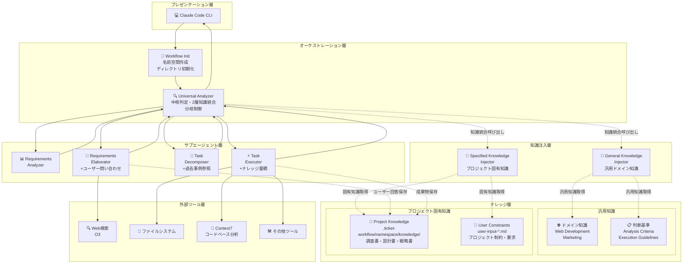
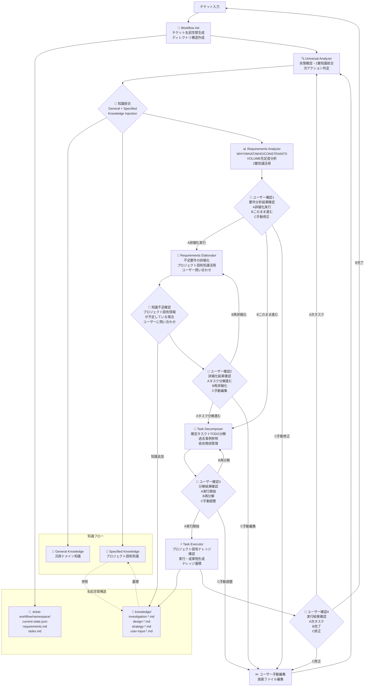

# ticket-workflow-command

## 🎯 システム概要

### コンセプト

このシステムは、**任意のドメインによらないチケット**（タスク・要件・プロジェクト）を受け取り、**実行可能なタスクレベルまで段階的にを適切な抽象度で分析・詳細化・分解**し、**実際にそれを実行できる**統合ワークフローツールです。


## 📊 主な機能

### 要件分析・詳細化
- **WHY/WHAT/WHO/CONSTRAINTS/VOLUME**の充足度分析
- 制約条件・要件の抜け漏れ防止
- プロジェクト固有知識を活用した詳細化
- 知識不足時の動的ユーザー問い合わせ

### タスク分解・依存関係管理
- 0.5人日基準での適切な粒度制御
- 確定タスクとTODOタスクの分離
- 依存関係の明確化と管理
- 並行実行可能性の最大化

### プロジェクト固有ナレッジ活用
- 過去の調査・設計・戦略成果物の自動活用
- ユーザー定義制約・要求事項の参照
- 横断的知識（他チケットからの知見）の活用
- 非コード成果物の自動分類・蓄積

### 実行管理
- 実行時の動的調査（プロジェクト固有知識優先）
- ユーザーとの対話的情報収集
- 実行結果の構造化記録
- 次タスクへの継承情報管理

## システム全体構成



### エージェント構成

- **🔍 Universal Analyzer**: 中核判定エンジン。状態確認・次アクション判定・2層知識統合
- **🔄 Workflow Init**: ワークフロー初期化。チケット名前空間・ディレクトリ構造作成
- **📊 Requirements Analyzer**: WHY/WHAT/WHO/CONSTRAINTS/VOLUMEの充足度分析（2層知識活用）
- **📝 Requirements Elaborator**: 不足要件の調査・補完・詳細化・ユーザー問い合わせ（プロジェクト固有知識活用）
- **🔧 Task Decomposer**: 確定タスク＋TODO分解・依存関係管理（過去事例参照）
- **⚡ Task Executor**: 前提確認・実行準備・実行内容・影響範囲確認（ナレッジ蓄積）
- **🧠 General Knowledge Injector**: 汎用ドメイン知識注入処理
- **🎯 Specified Knowledge Injector**: プロジェクト固有知識取得・活用

### ワークフロー



### ワークフローの特徴

1. **4段階のユーザー確認**
   - 要件分析結果の確認
   - 生成要件の確認
   - タスク分解結果の確認
   - タスク実行前の確認

2. **段階的詳細化**
   - 要件分析 → 要件詳細化 → タスク分解 → タスク実行

3. **依存関係管理**
   - 確定タスクとTODOタスクの分離
   - 依存関係に基づく実行順序の最適化

4. **状態管理**
   - current-state.jsonによる進捗・承認状態の追跡
   - ユーザー選択履歴の記録

## 🚀 使用方法

```bash
# ワークフロー開始
/ticket-workflow "チケット内容"
```

## 📁 ディレクトリ構成

```
# user memoryを想定
.claude/
├── commands/
│   └── ticket-workflow.md              # 統合制御・状態遷移管理
├── agents/
│   ├── universal-analyzer.md           # 中核判定・2層知識統合
│   ├── workflow-init.md                # ワークフロー初期化
│   ├── requirements-analyzer.md        # 充足度分析処理
│   ├── requirements-elaborator.md      # 詳細化・ユーザー問い合わせ処理
│   ├── task-decomposer.md             # 分解処理ロジック
│   ├── task-executor.md               # 実行・ナレッジ蓄積処理
│   ├── general-knowledge-injector.md   # 汎用ドメイン知識注入
│   └── specified-knowledge-injector.md # プロジェクト固有知識取得
└── docs/
    └── ticket-workflow/
        ├── core/...                    # 汎用的な判断軸・基準
        └── domains/
            ├── web-development/
            │   ├── requirements/
            │   │   └──  constraints.md
            │   ├── task-execution/
            │   │   ├── implementation-guide.md
            └── marketing/... # マーケティングドメインの知識

# project
{プロジェクトルート}/
├── CLAUDE.md                           # プロジェクト全体知識
├── .ticket-workflow/                   # 実行時生成（新構造）
│   └── {ticket-namespace}/             # チケット別名前空間
│       ├── current-state.json          # 現在状態
│       ├── requirements.md             # 蓄積要件
│       ├── tasks.md                    # タスク一覧
│       ├── tasks/                      # 個別タスク
│       │   ├── task1.md
│       │   └── task2.md
│       └── knowledge/                  # プロジェクト固有ナレッジ(下記は例)
│           ├── investigation-*.md      # 調査書
│           ├── design-*.md             # 設計書
│           ├── strategy-*.md           # 戦略書
│           └── user-input-*.md         # ユーザー定義制約
└── {既存プロジェクト構造}
```

## 🎬 デモ

*こちらにデモ動画を掲載予定*

実際のチケットを使用したワークフローの動作例：
- チケット入力からタスク分解までの流れ
- プロジェクト固有ナレッジの活用例
- 段階的詳細化プロセスの実際

## 🔮 今後の方向性

- **外部ツールAPI連携**
  - Notion API、Linear API統合
  - チケット自動同期機能

- **コードベース分析強化**
  - プロジェクト構造の深度分析
  - 技術的依存関係の自動抽出

- **MCPサーバー化**
  - Claude Code以外での利用可能化
  - 他の開発環境・IDEとの統合

- **共創AIプラットフォーム化**
  - 複数ユーザーでの知識共有
  - チーム利用最適化


## Appendix

### 📋 プロジェクトの価値

#### 解決したい問題

1. **タスク抽象度の標準化不足**
   - 個人によってタスクの粒度が異なる
   - 大きすぎる/小さすぎるタスクの混在

2. **制約条件・要件の抜け漏れ**
   - 重要な制約の見落としによる手戻り発生
   - 要件定義の不完全性

3. **手作業による非効率な分解プロセス**
   - 人による分解プロセスでAIに比べてスピードが低下
   - 属人的な分解品質のばらつき

#### 提供価値（対応する解決策）

1. **AI制御された抽象度管理**
   - 0.5人日基準での一貫した粒度制御
   - 適切なタスク分解レベルの自動判定

2. **制約条件・要件の抜け漏れ防止**
   - AIによる体系的な要件チェック思考
   - ドメイン知識に基づく制約条件の網羅

3. **AIによる分解プロセスの効率化**
   - 高速かつ一貫性のある自動分解
   - プロジェクト固有知識の活用による精度向上

### 特徴

- **汎用性**: ドメインに依存しない汎用フレームワーク
- **段階的詳細化**: 4段階のユーザー確認による透明性
- **知識蓄積**: プロジェクト固有ナレッジの継続的活用

### 🤝 共創AIとの関わり

#### 共創AI（Co-creative AI）の定義

共創AIとは、**AIと人間が協力して価値を創造**するプロセスです。基本的なサイクルは以下の通りです：

```
人間がAIに指示 → AIが生成 → 人間が評価 → 改善・反復
```

#### このプロジェクトが解決する共創AIの課題

従来の共創AIサイクルには以下の課題がありました：

1. **人の指示の曖昧性**
   - フィードバックが不明確で、AIが適切に理解できない
   - 指示の抽象度が一定しない

2. **評価の属人性**
   - 個人の主観による評価のばらつき
   - 評価基準の不統一

3. **AIの生成品質のばらつき**
   - 同じ指示でも結果の品質が安定しない
   - コンテキスト不足による出力品質の低下

#### 本システムによる改善

このチケットワークフローシステムは、**共創AIのループをより強固にする**ことで上記課題を解決します：

- **構造化された指示**: 段階的詳細化により明確で一貫した指示を実現
- **標準化された評価**: 段階的なユーザー確認による客観的評価基準
- **プロジェクト固有知識の活用**: AIの生成品質を文脈に応じて向上
- **継続的学習**: 過去の成果物を活用した品質向上循環
