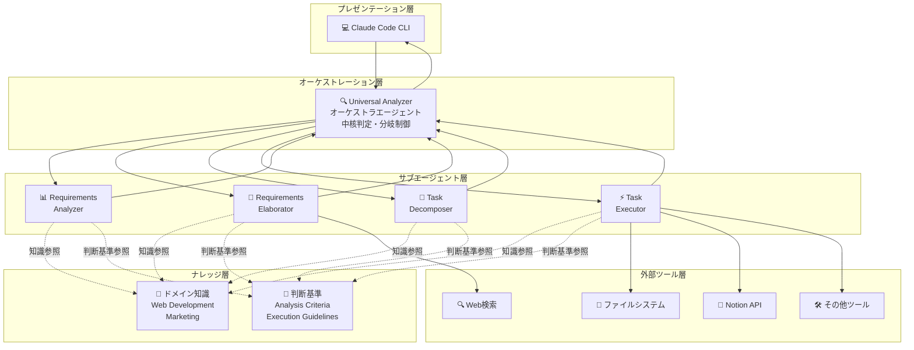
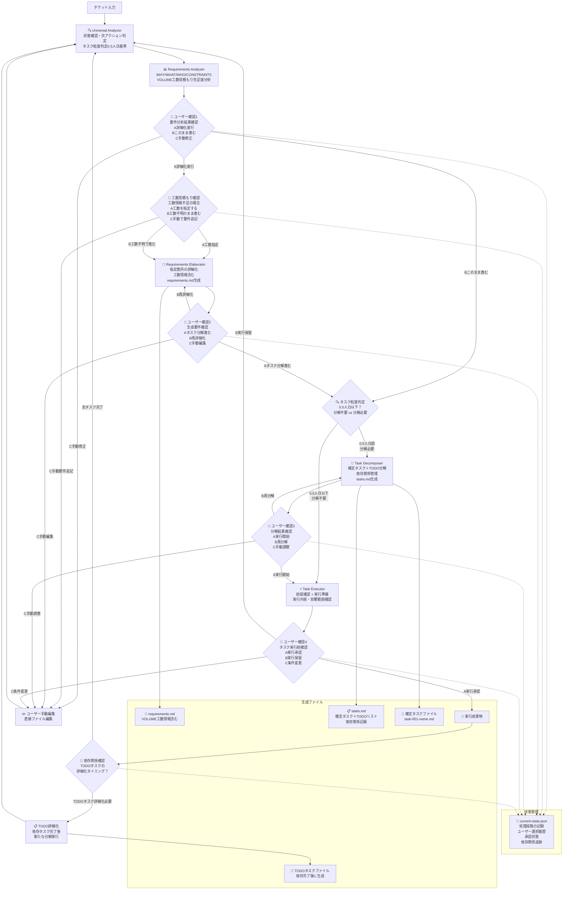

# ticket-workflow-command

チケット（タスク・要件・プロジェクト）を適切な抽象度で分析・詳細化・分解し、実行可能なタスクレベルまで段階的に詳細化するワークフローコマンドツール。

## 📋 目的

任意のチケットを受け取り、以下を実現します：
- 適切な抽象度での分析・詳細化・分解
- 制約条件や要件の抜け漏れ防止
- 実行可能なタスクレベル（0.5人日基準）までの段階的詳細化
- ドメインに依存しない汎用フレームワークの提供

## 🎯 コア価値

- **品質担保**: 制約条件や要件の抜け漏れを防ぐ
- **効率化**: 適切な抽象度での段階的詳細化により、無駄な作業を削減
- **汎用性**: ドメインに依存しない汎用フレームワークで様々な業務に対応
- **透明性**: 4段階のユーザー確認により、意思決定の透明性を確保

## 🏗️ Architecture構成

### システム全体構成



### エージェント構成

- **🔍 Universal Analyzer**: 中核判定エンジン。状態確認・次アクション判定・タスク粒度判定（0.5人日基準）
- **📊 Requirements Analyzer**: WHY/WHAT/WHO/CONSTRAINTS/VOLUMEの充足度分析
- **📝 Requirements Elaborator**: 不足要件の調査・補完・詳細化
- **🔧 Task Decomposer**: 確定タスク＋TODO分解・依存関係管理
- **⚡ Task Executor**: 前提確認・実行準備・実行内容・影響範囲確認
- **🧠 Domain Injector**: ドメイン知識注入処理

## 🔄 Workflow

### 完全なワークフローフロー



### ワークフローの特徴

1. **4段階のユーザー確認**
   - 要件分析結果の確認
   - 生成要件の確認
   - タスク分解結果の確認
   - タスク実行前の確認

2. **段階的詳細化**
   - 要件分析 → 要件詳細化 → タスク分解 → タスク実行

3. **依存関係管理**
   - 確定タスクとTODOタスクの分離
   - 依存関係に基づく実行順序の最適化

4. **状態管理**
   - current-state.jsonによる進捗・承認状態の追跡
   - ユーザー選択履歴の記録

## 🚀 使用方法

```bash
# ワークフロー開始
/ticket-workflow "チケット内容"
```

## 📁 ディレクトリ構成

※

```
# user memory
.claude/
├── commands/
│   └── ticket-workflow.md              # 統合制御・状態遷移管理
├── agents/
│   ├── universal-analyzer.md           # 判定処理ロジック
│   ├── requirements-analyzer.md        # 充足度分析処理
│   ├── requirements-elaborator.md      # 詳細化処理
│   ├── task-decomposer.md             # 分解処理ロジック
│   ├── task-executor.md               # 実行処理ロジック
│   └── domain-injector.md             # ドメイン知識注入
└── docs/
    └── ticket-workflow/
        ├── core/...                    # 汎用的な判断軸・基準
        └── domains/
            ├── web-development/
            │   ├── requirements/
            │   │   └──  constraints.md
            │   ├── task-execution/
            │   │   ├── implementation-guide.md
            └── marketing/... # マーケティングドメインの知識

# project
{プロジェクトルート}/
├── CLAUDE.md                           # プロジェクト全体知識
├── ticket-workflow/                    # 実行時生成
│   ├── current-state.json              # 現在状態
│   ├── requirements.md                 # 蓄積要件
│   ├── tasks.md                        # タスク一覧
│   └── tasks/                          # 個別タスク
│       ├── task1.md
│       └── task2.md
└── {既存プロジェクト構造}
```

## 📊 主な機能

### 要件分析
- WHY（目的・価値）の明確化
- WHAT（作業内容）の具体化
- WHO（関係者・責任）の特定
- CONSTRAINTS（制約条件）の網羅
- VOLUME（工数・規模）の見積もり

### タスク分解
- 0.5人日基準での適切な粒度管理
- 依存関係の明確化と管理
- 確定タスクとTODOタスクの分離
- 並行実行可能性の最大化

### 実行管理
- 実行時の動的調査
- ユーザーとの対話的情報収集
- 実行結果の構造化記録
- 次タスクへの継承情報管理

## ライセンス

MIT License