# ticket-workflow-command

## 🎯 システム概要

### コンセプト

チケット（タスク・要件・プロジェクト）を受け取り、実行可能なタスクレベルまで分析・詳細化・分解し、それを実行できる統合ワークフローツールです。

### 提供価値

#### 制約条件・要件の抜け漏れによる手戻りの防止
- AIによる体系的・網羅的な要件及び制約チェック

#### 適切な抽象度での分解による進捗管理コストの省力化
- AIによる適切なタスク分解レベルの自動制御

#### 詳細化/分解プロセスの効率化
- AIの利用により人間以上のテキスト入力／ファイル操作のスループットが向上


## 📋 前提条件

- **Claude Code** がインストールされていること
- **context7 MCP** が利用可能であること


## 🚀 インストール

```bash
# リポジトリをクローン
git clone https://github.com/tamtam-fitness/ticket-workflow-command

# インストールスクリプトを実行
cd ticket-workflow-command
./claude-install.sh
```


## 📝 使い方

```bash
# ワークフロー開始
/ticket-workflow "チケット内容"

# または、ファイルパスを指定
/ticket-workflow path/to/ticket.md
```


## 🔄 利用フロー

### ① チケット入力
チケット内容を指定してコマンド実行

### ② 要件分析・詳細化
システムが要件分析・詳細化を実行

### ③ タスク分解・依存関係管理
4段階のユーザー確認ポイントで進行を制御

### ④ タスク実行・ナレッジ蓄積
タスク実行とナレッジの蓄積が自動的に行われる


## 🎬 デモ

[](https://youtu.be/zgOs4m3SXM4)

*画像をクリックするとYouTubeで再生します*


## 📊 主な機能

### 要件分析・詳細化
- **WHY/WHAT/WHO/CONSTRAINTS/VOLUME**の充足度分析
- 制約条件・要件の抜け漏れ防止
- プロジェクト固有知識を活用した詳細化
- 知識不足時の動的ユーザー問い合わせ

### タスク分解・依存関係管理
- 0.5人日基準での適切な粒度制御
- 確定タスクとTODOタスクの分離
- 依存関係の明確化と管理
- 並行実行可能性の最大化

### プロジェクト固有ナレッジ活用
- 過去の調査・設計・戦略成果物の自動活用
- ユーザー定義制約・要求事項の参照
- 横断的知識（他チケットからの知見）の活用
- 非コード成果物の自動分類・蓄積

### 実行管理
- 実行時の動的調査（プロジェクト固有知識優先）
- ユーザーとの対話的情報収集
- 実行結果の構造化記録
- 次タスクへの継承情報管理

## システム全体構成


### エージェント構成

- **🔍 Universal Analyzer**: 中核判定エンジン。状態確認・次アクション判定・2層知識統合
- **🔄 Workflow Init**: ワークフロー初期化。チケット名前空間・ディレクトリ構造作成
- **📊 Requirements Analyzer**: WHY/WHAT/WHO/CONSTRAINTS/VOLUMEの充足度分析（2層知識活用）
- **📝 Requirements Elaborator**: 不足要件の調査・補完・詳細化・ユーザー問い合わせ（プロジェクト固有知識活用）
- **🔧 Task Decomposer**: 確定タスク＋TODO分解・依存関係管理（過去事例参照）
- **⚡ Task Executor**: 前提確認・実行準備・実行内容・影響範囲確認（ナレッジ蓄積）
- **🧠 General Knowledge Injector**: 汎用ドメイン知識注入処理
- **🎯 Specified Knowledge Injector**: プロジェクト固有知識取得・活用

### ワークフロー

```mermaid
graph LR
    INPUT[チケット入力] --> WF_INIT[🔄 Workflow Init<br/>チケット名前空間生成<br/>ディレクトリ構造作成]

    WF_INIT --> UA[🔍 Universal Analyzer<br/>状態確認・2層知識統合<br/>次アクション判定]

    UA --> KNOWLEDGE_INJECTION{🧠 知識統合<br/>General + Specified<br/>Knowledge Injection}

    KNOWLEDGE_INJECTION --> REQ_ANA[📊 Requirements Analyzer<br/>WHY/WHAT/WHO/CONSTRAINTS<br/>VOLUME充足度分析<br/>2層知識活用]

    REQ_ANA --> USER_CHECK1{👤 ユーザー確認1<br/>要件分析結果確認<br/>A詳細化実行<br/>Bこのまま進む<br/>C手動修正}

    USER_CHECK1 -->|A詳細化実行| REQ_ELAB[📝 Requirements Elaborator<br/>不足要件の詳細化<br/>プロジェクト固有知識活用<br/>ユーザー問い合わせ]

    REQ_ELAB --> USER_QUERY{💬 知識不足確認<br/>プロジェクト固有情報<br/>が不足している場合<br/>ユーザーに問い合わせ}

    USER_QUERY --> USER_CHECK2{👤 ユーザー確認2<br/>詳細化結果確認<br/>Aタスク分解進む<br/>B再詳細化<br/>C手動編集}

    USER_CHECK1 -->|Bこのまま進む| TASK_DECOMP[🔧 Task Decomposer<br/>確定タスク＋TODO分解<br/>過去事例参照<br/>依存関係管理]
    USER_CHECK2 -->|Aタスク分解進む| TASK_DECOMP

    TASK_DECOMP --> USER_CHECK3{👤 ユーザー確認3<br/>分解結果確認<br/>A実行開始<br/>B再分解<br/>C手動調整}

    USER_CHECK3 -->|A実行開始| TASK_EXEC[⚡ Task Executor<br/>プロジェクト固有ナレッジ確認<br/>実行・成果物生成<br/>ナレッジ蓄積]

    TASK_EXEC --> USER_CHECK4{👤 ユーザー確認4<br/>実行結果確認<br/>A次タスク<br/>B完了<br/>C修正}

    USER_CHECK4 -->|A次タスク| UA
    USER_CHECK4 -->|B完了| END[完了]

    %% 手動編集とループバック
    USER_CHECK1 -->|C手動修正| USER_MANUAL[✏️ ユーザー手動編集<br/>直接ファイル編集]
    USER_CHECK2 -->|C手動編集| USER_MANUAL
    USER_CHECK3 -->|C手動調整| USER_MANUAL
    USER_CHECK4 -->|C修正| USER_MANUAL
    USER_MANUAL --> UA

    %% 再実行ループ
    USER_CHECK2 -->|B再詳細化| REQ_ELAB
    USER_CHECK3 -->|B再分解| TASK_DECOMP

    %% 知識構造
    subgraph KNOWLEDGE_FLOW [知識フロー]
        direction TB
        GEN_KNOW[🧠 General Knowledge<br/>汎用ドメイン知識]
        SPEC_KNOW[🎯 Specified Knowledge<br/>プロジェクト固有知識]
    end

    subgraph NAMESPACE_STRUCTURE [名前空間構造]
        direction TB
        STATE["📁 .ticket-workflow/namespace/<br/>current-state.json<br/>requirements.md<br/>tasks.md"]
        KNOWLEDGE_STORE["💾 knowledge/<br/>investigation-*.md<br/>design-*.md<br/>strategy-*.md<br/>user-input-*.md"]
    end

    %% 知識フローの接続
    KNOWLEDGE_INJECTION -.->|取得| GEN_KNOW
    KNOWLEDGE_INJECTION -.->|取得| SPEC_KNOW
    WF_INIT -.->|生成| STATE
    USER_QUERY -.->|知識追加| KNOWLEDGE_STORE
    TASK_EXEC -.->|成果物保存| KNOWLEDGE_STORE
    SPEC_KNOW -.->|参照| KNOWLEDGE_STORE
    KNOWLEDGE_STORE -.->|蓄積| SPEC_KNOW
```



## 📁 ディレクトリ構成

```
# user memoryを想定
.claude/
├── commands/
│   └── ticket-workflow.md              # 統合制御・状態遷移管理
├── agents/
│   ├── universal-analyzer.md           # 中核判定・2層知識統合
│   ├── workflow-init.md                # ワークフロー初期化
│   ├── requirements-analyzer.md        # 充足度分析処理
│   ├── requirements-elaborator.md      # 詳細化・ユーザー問い合わせ処理
│   ├── task-decomposer.md             # 分解処理ロジック
│   ├── task-executor.md               # 実行・ナレッジ蓄積処理
│   ├── general-knowledge-injector.md   # 汎用ドメイン知識注入
│   └── specified-knowledge-injector.md # プロジェクト固有知識取得
└── docs/
    └── ticket-workflow/
        ├── core/...                    # 汎用的な判断軸・基準
        └── domains/
            ├── web-development/
            │   ├── requirements/
            │   │   └──  constraints.md
            │   ├── task-execution/
            │   │   ├── implementation-guide.md
            └── marketing/... # マーケティングドメインの知識

# project
{プロジェクトルート}/
├── CLAUDE.md                           # プロジェクト全体知識
├── .ticket-workflow/                   # 実行時生成（新構造）
│   └── {ticket-namespace}/             # チケット別名前空間
│       ├── current-state.json          # 現在状態
│       ├── requirements.md             # 蓄積要件
│       ├── tasks.md                    # タスク一覧
│       ├── tasks/                      # 個別タスク
│       │   ├── task1.md
│       │   └── task2.md
│       └── knowledge/                  # プロジェクト固有ナレッジ(下記は例)
│           ├── investigation-*.md      # 調査書
│           ├── design-*.md             # 設計書
│           ├── strategy-*.md           # 戦略書
│           └── user-input-*.md         # ユーザー定義制約
└── {既存プロジェクト構造}
```

## ❓ Q&A

### Q: 既存のプロジェクト管理ツール（Jira、Notion等）との連携は？
**A:** 今後実装予定です。特にNotionとの連携で、タスクURLを受け取って処理する流れが最もシームレスと考えています。

### Q: GitHub CopilotやCursor等のAI開発ツールとの違いは？
**A:**
**Cursor/GitHub Copilotの課題:**
- ユーザーによる追加のプロンプトチューニングが必要
- サブエージェント機能が標準で備わっていない

**本システムの優位性:**
- サブエージェントの切り出し・実行機能を標準提供
- 各エージェント用の最適化されたプロンプト指示を実装済み

### Q: AWS Kiloとの差別化は？
**A:**
**Kiloの特徴:**
- Web開発のコーディングに特化
- 要件 → デザイン → 設計 → タスクの4層構造
- 要件の深掘りや制約考慮が弱い

**本システムの特徴:**
- より汎用的なアプローチ
- 要件整理 → タスク化の2層構造
- 設計もタスクとして扱う柔軟性
- 生成物は同様でも、より汎用的なプロセス

